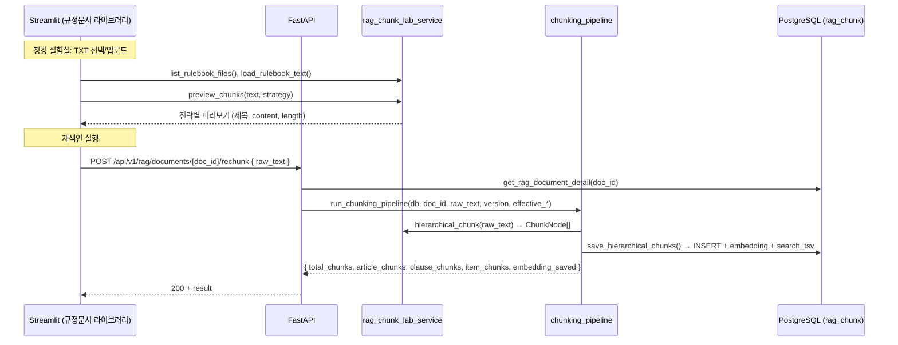

# 청킹(Chunking) 동작 및 프로세스

> 규정집 RAG 청킹 전략, 계층 구조, 파이프라인, 검색 연계.  
> 코드 기준: `services/rag_chunk_lab_service.py`, `services/chunking_pipeline.py`, `services/policy_service.py`.

---

## 목차

1. [청킹이란](#1-청킹이란)
2. [전략 개요](#2-전략-개요)
3. [계층적 청킹 상세](#3-계층적-청킹-상세)
4. [파이프라인: 청킹 → 저장 → 임베딩](#4-파이프라인-청킹--저장--임베딩)
5. [검색에서의 청크 사용](#5-검색에서의-청크-사용)
6. [데이터 저장소·테이블](#6-데이터-저장소테이블)
7. [API·UI 흐름](#7-apiui-흐름)
8. [설명회 요약 포인트](#8-설명회-요약-포인트)
9. [3단계 청킹 적용 후 점검·보완 이력](#9-3단계-청킹-적용-후-점검보완-이력)

---

## 1. 청킹이란

| 항목 | 설명 |
|------|------|
| **역할** | 규정집 원문을 **검색·임베딩에 적합한 단위**로 나누어 `dwp_aura.rag_chunk`에 저장. 에이전트의 규정 검색(policy_rulebook_probe)은 이 청크를 BM25·Dense·RRF·Rerank로 조회한다. |
| **대상** | 규정집 TXT 원문 (제n장, 제n조, 항/호 구조). 업로드 또는 번들 경로(`규정집/`, `규정집/uploads/`)의 텍스트 파일. |
| **산출물** | **ARTICLE** 노드(조문 단위) + **CLAUSE** 노드(항 ①②③ 단위) + **ITEM** 노드(호 1./가. 단위). 3단계 계층(parent_id)으로 보존하며, 검색 시 CLAUSE/ITEM에 부모 맥락을 붙여 문맥을 확장한다. |

---

## 2. 전략 개요

청킹 실험실(UI)과 실제 인덱싱에 사용되는 전략은 아래와 같다.

| 전략 | 설명 | 용도 |
|------|------|------|
| **hierarchical_parent_child** | 조문(ARTICLE) → 항(①②③, CLAUSE) → 호(1./가., ITEM) 3단계 계층 분리. 단편 조문은 다음 조문과 병합. | **실제 인덱싱·검색**에 사용 (기본값) |
| **article_first** | 제n조 단위로만 분할. 항/호 미분리. | 미리보기·비교용 |
| **sliding_window** | 고정 길이(700자)·오버랩(120자) 슬라이딩 윈도우. | 미리보기·비교용 |
| **hybrid_policy** | 조문 단위로 자르되, 900자 초과 시 해당 조문 본문만 슬라이딩(650자, 100자 오버랩). | 미리보기·비교용 |

- **인덱싱(rechunk)** 시에는 항상 **hierarchical_parent_child** 한 가지 전략만 사용한다.  
- `preview_chunks(text, strategy)`로 전략별 미리보기 결과를 UI에서 비교할 수 있다.

> 참고: [`services/rag_chunk_lab_service.py`](services/rag_chunk_lab_service.py) — `hierarchical_chunk()`, `preview_chunks()`, `_split_article_sections()`, `_window_split()`

---

## 3. 계층적 청킹 상세

### 3.1 파싱 순서

1. **장(章)** 구분: `제\s*\d+\s*장` 패턴으로 장 제목 추출 → `semantic_group`(현재 장) 유지.
2. **조(條)** 구분: `제\s*\d+\s*조(?:\s*\([^)]+\))?` 패턴으로 조문 헤더·본문 분리.
3. **항(項)** 구분: 조문 본문 내 `①②…⑩` 마커만으로 항 단위 분리 → CLAUSE 노드. (`_split_into_clauses()` — 호(1./가.)는 포함하지 않음.)
4. **호(號)** 구분: 각 CLAUSE 본문 내 줄 시작 `\d+\.\s`, `가\.\s` 등 패턴으로 호 단위 분리 → ITEM 노드. (`_split_into_items()` — 문장 중간 "표 1. 참조" 오매칭 방지를 위해 줄 시작 앵커 사용.)

### 3.2 ChunkNode 구조

| 필드 | 설명 |
|------|------|
| `node_type` | `"ARTICLE"` \| `"CLAUSE"` \| `"ITEM"` |
| `regulation_article` | 조문 번호 (예: 제23조) |
| `regulation_clause` | 항 마커 (예: ①, ②, ③) — CLAUSE/ITEM 공통 |
| `regulation_item` | 호 마커 (예: 1., 가.) — **ITEM 노드 전용** |
| `parent_title` | 조문 전체 제목 (예: 제23조 (식대)) |
| `parent_clause_chunk_index` | ITEM의 부모 CLAUSE chunk_index — DB에서 parent_id 연결용 |
| `chunk_text` | 저장·표시용 전체 텍스트 (contextual_header + 본문). ITEM은 `[제7장 > 제23조 > (식대) > ③] 1. …` 형식. |
| `search_text` | 검색·임베딩용 텍스트 (본문만). BM25/Dense는 이 필드를 대상으로 한다. |
| `contextual_header` | RAG 문맥용 접두어. CLAUSE: `[제1장 > 제23조 > (식대)] `, ITEM: `[제7장 > 제23조 > (식대) > ③] ` (`_build_item_contextual_header`) |
| `semantic_group` | 장 단위 그룹 (예: 제1장 총칙) |
| `merged_with` | 짧은 조문을 다음 조문과 병합했을 때의 대상 조문 번호 |

### 3.3 단편 조문 병합

- **PARENT_MIN = 200**: 조문 본문 길이가 200자 미만이면 **다음 조문과 병합**하여 하나의 ARTICLE로 저장.
- 마지막 조문만 짧을 경우 **이전 ARTICLE에 흡수**.
- 병합된 경우 `merged_with`에 다음 조문 번호를 넣어 추적.

### 3.4 CLAUSE 생성 조건

- 항(①②③)이 **2개 이상**인 조문만 CLAUSE 노드를 생성.
- 단항 조문은 ARTICLE 노드만 생성.

### 3.5 ITEM 생성 조건

- 각 CLAUSE 본문에 대해 `_split_into_items(clause_text)` 호출. **marker(항 마커) 유무와 무관**하게 호(1./가.) 패턴이 있으면 ITEM 노드 생성.
- 호 패턴이 없으면 ITEM은 생성하지 않음. (실제 규정집에 1./가. 형식만 있어 현재 패턴으로 충분.)
- **보완 이력**: 초기에는 `if marker:` 조건으로 빈 marker CLAUSE(제17조·제50조 등)에서 ITEM이 누락되던 버그가 있었으며, `if items:` 조건으로 변경 후 ITEM 50개 → 91개로 복구됨.

> 참고: [`services/rag_chunk_lab_service.py`](services/rag_chunk_lab_service.py) — `_extract_article_title()`, `_split_into_clauses()`(항만), `_split_into_items()`(호), `_merge_short_articles()`, `_build_contextual_header()`, `_build_item_contextual_header()`

---

## 4. 파이프라인: 청킹 → 저장 → 임베딩

```
[원문 TXT] → hierarchical_chunk() → ChunkNode[] (ARTICLE + CLAUSE + ITEM)
       → save_hierarchical_chunks()
          1) 기존 청크 비활성화 (is_active=false)
          2) ARTICLE 노드 INSERT (parent_id=NULL)
          3) CLAUSE 노드 INSERT (parent_id=해당 ARTICLE chunk_id), clause_chunk_id_map 기록
          4) ITEM 노드 INSERT (parent_id=해당 CLAUSE chunk_id, clause_chunk_id_map으로 조회)
          5) search_text 기준 배치 임베딩 → embedding_az(또는 설정 컬럼) UPDATE
          6) search_tsv = to_tsvector('simple', search_text) UPDATE
       → DB commit
```

- **임베딩 모델**: Azure/OpenAI `text-embedding-3-large` (3072차원, 설정으로 변경 가능).
- **임베딩 대상**: `search_text`(본문 위주). `chunk_text`가 아닌 `search_text`를 사용해 검색 품질을 높인다.
- **search_tsv**: PostgreSQL `to_tsvector('simple', ...)`로 BM25(ts_rank_cd) 검색에 사용.

> 참고: [`services/chunking_pipeline.py`](services/chunking_pipeline.py) — `run_chunking_pipeline()`, `save_hierarchical_chunks()`, `embed_texts()`

---

## 5. 검색에서의 청크 사용

에이전트 도구 **policy_rulebook_probe**는 `search_policy_chunks(db, body_evidence, limit)`를 호출한다.

### 하이브리드 RAG 검색 파이프라인

본 프로젝트는 **하이브리드 RAG 검색 파이프라인**을 적용하고 있다. 키워드 검색(BM25)과 의미 검색(Dense)을 함께 사용한 뒤 RRF(순위 기반 융합)로 융합하고, 필요 시 Cross-Encoder Rerank로 재정렬하여, 단일 검색 방식보다 **재현율·정확도·안정성**을 높인다.

| 구성 요소 | 역할 | 장점 |
|-----------|------|------|
| **BM25** (tsvector) | 키워드·동의어 확장(search_tsv) 기반 검색 | 규정 용어(조문 번호, 전문 용어) 정확 매칭 |
| **Dense** (pgvector) | 쿼리 임베딩과의 코사인 유사도 검색 | 의역·유사 표현, 문맥 기반 검색 |
| **RRF** (Reciprocal Rank Fusion) | BM25·Dense 순위 융합 (k=60) | 한쪽만 약해도 다른 쪽으로 보완, 순위 안정화 |
| **Cross-Encoder Rerank** (선택) | query–chunk 쌍 재점수화(ko-reranker) | 최종 상위 N건 정확도 향상 |
| **케이스별 가중치** | case_type에 따라 BM25/Dense 비율 조정 | 휴일·한도·업종 등 유형별 검색 특성 반영 |

→ 구현: [`services/policy_service.py`](services/policy_service.py) — `search_policy_chunks()`, `_get_rrf_weights()`, `_reciprocal_rank_fusion()` / [`services/retrieval_quality.py`](services/retrieval_quality.py) — `rerank_with_cross_encoder()`

### 5.1 검색 파이프라인 (단계)

1. **키워드 생성**: `build_policy_keywords(body_evidence)` — case_type, 휴일, 한도, MCC, 전표 항목(sgtxt, hkont) 등.
2. **BM25**: `rag_chunk.search_tsv`에 대한 `to_tsquery` 검색, `ts_rank_cd`로 정렬.
3. **Dense**: 쿼리 텍스트를 임베딩한 뒤 `embedding_az <=> query_vector` (cosine distance)로 유사도 검색.
4. **RRF (Reciprocal Rank Fusion)**: BM25 순위와 Dense 순위를 `weight/(k+rank)` (k=60)로 융합.
5. **Contextual 보강**: `_enrich_with_parent_context()` — CLAUSE는 부모 ARTICLE의 `parent_title`을 chunk_text에 prepend하고 `context_chunk_ids` 설정. **ITEM**은 chunk_text에 이미 `_build_item_contextual_header`가 포함되므로 prepend 없이 **부모 CLAUSE의 chunk_id를 context_chunk_ids에만** 설정.
6. **Cross-Encoder Rerank**: (선택) `sentence-transformers`의 `Dongjin-kr/ko-reranker`로 query–chunk 쌍 재정렬. 미설치 시 RRF 순위 유지.
7. **Fallback**: BM25·Dense 모두 실패 시 LIKE 기반 lexical 검색.

### 5.2 반환 형태

각 청크에 대해 `doc_id`, `article`, `clause`, `parent_title`, `chunk_text`, `chunk_ids`, `context_chunk_ids`, `retrieval_score`, `score_detail`(bm25/dense/rrf/cross_encoder) 등이 반환된다. **3단계 청킹 보완 후** 검색 결과에 **`node_type`**(ARTICLE/CLAUSE/ITEM)과 **`item`**(호 마커, metadata_json.regulation_item — "1.", "가." 등)이 추가되어, 에이전트·UI에서 항·호 단위 근거 표시에 활용한다.

### 5.3 동일 조문 중복 채택 방지

- **원인**: 한 조문(예: 제23조 식대)은 계층 청킹 시 **ARTICLE 1개 + CLAUSE N개 + ITEM M개**로 저장된다. 검색 시 동일 조문의 여러 청크가 상위에 올라오면 채택 인용 목록에 제23조가 중복 노출될 수 있다.
- **대응**: policy_rulebook_probe(agent_tools)에서 **채택 인용(policy_refs)** 을 만들 때 **조문(regulation_article) 단위로 중복 제거**한다. 후보를 점수 순으로 보되, 이미 채택한 조문은 건너뛰고 **서로 다른 조문만 최대 4~5건** 채택한다. ITEM 노드가 상위에 있어도 동일 조문이면 한 건만 선택되며, 화면에는 제23조가 한 번만 표시된다.
- **그 외 근거(제39조, 제38조 등)**: 서로 다른 조문이므로 각각 1건씩 유지된다.

> 참고: [`services/policy_service.py`](services/policy_service.py) — `search_policy_chunks()`, `_search_bm25()`, `_search_dense()`, `_reciprocal_rank_fusion()`, `_enrich_with_parent_context()`  
> 참고: [`services/retrieval_quality.py`](services/retrieval_quality.py) — `rerank_with_cross_encoder()`  
> 참고: [`agent/agent_tools.py`](agent/agent_tools.py) — policy_rulebook_probe에서 `search_policy_chunks` 호출 및 조문별 1건 채택

---

## 6. 데이터 저장소·테이블

### 6.1 dwp_aura.rag_chunk

| 컬럼(요지) | 설명 |
|------------|------|
| chunk_id, doc_id, tenant_id | PK·문서·테넌트 |
| chunk_text, search_text | 표시용 전체 텍스트, 검색/임베딩용 본문 |
| regulation_article, regulation_clause, parent_title | 규정 메타 |
| node_type, parent_id, parent_chunk_id | ARTICLE / CLAUSE / ITEM, 계층 |
| chunk_level | root(ARTICLE) / child(CLAUSE) / leaf(ITEM) |
| chunk_index, page_no | 순서·페이지 |
| version, effective_from, effective_to | 문서 버전·시행일 |
| embedding_az (또는 설정 컬럼) | pgvector, cosine 검색용 |
| search_tsv | tsvector, BM25용 |
| metadata_json | semantic_group, merged_with, **regulation_item**(ITEM 호 마커) 등 |
| is_active | 재색인 시 기존 청크 false 처리 |

### 6.2 재색인 시 동작

- **rechunk** 시 해당 `doc_id`의 기존 청크는 일괄 `is_active = false` 후, 새 ChunkNode 기준으로 INSERT.
- 동일 run에서 **ARTICLE** 먼저 INSERT → article_chunk_id_map 확보 → **CLAUSE** INSERT 시 parent_id 연결, **clause_chunk_id_map** 기록 → **ITEM** INSERT 시 parent_id = clause_chunk_id_map[parent_clause_chunk_index].

### 6.3 데이터 저장소·흐름 요약

```mermaid
flowchart LR
    subgraph Ingest["인덱싱"]
        TXT[원문 TXT]
        Lab[rag_chunk_lab_service]
        Pipe[chunking_pipeline]
        DB[(dwp_aura.rag_chunk)]
        TXT -->|hierarchical_chunk| Lab
        Lab -->|ChunkNode[]| Pipe
        Pipe -->|save_hierarchical_chunks| DB
    end

    subgraph Search["검색 (policy_rulebook_probe)"]
        BE[body_evidence]
        KW[build_policy_keywords]
        BM[BM25]
        DN[Dense]
        RRF[RRF]
        Rerank[Rerank]
        BE --> KW
        KW --> BM
        KW --> DN
        BM --> RRF
        DN --> RRF
        RRF --> Rerank
        Rerank --> Chunks[청크 반환]
    end

    DB --> BM
    DB --> DN
```

| 구간 | 데이터 | 처리 |
|------|--------|------|
| **인덱싱** | 원문 TXT | hierarchical_chunk → save_hierarchical_chunks → ARTICLE/CLAUSE/ITEM INSERT + embedding_az + search_tsv |
| **검색** | body_evidence | 키워드 → BM25/Dense → RRF → (선택) Rerank → CLAUSE/ITEM 문맥 보강(_enrich_with_parent_context) 후 node_type·item 포함해 반환 |

> 참고: [`services/chunking_pipeline.py`](services/chunking_pipeline.py) — `save_hierarchical_chunks()` 내 UPDATE/INSERT 로직  
> 참고: [`services/rag_library_service.py`](services/rag_library_service.py) — 문서 상세의 total_chunk_count, avg_chunk_length 조회

---

## 7. API·UI 흐름



- **GET /api/v1/rag/documents**, **GET /api/v1/rag/documents/{doc_id}**: 문서 목록·상세(청크 수, 평균 길이 포함).
- **POST /api/v1/rag/documents/{doc_id}/rechunk**: 요청 body에 `raw_text` 필수. 선택한 규정집 원문으로 해당 doc_id 계층 청킹 + 임베딩 + search_tsv 재색인.

> 참고: [`main.py`](main.py) — `/api/v1/rag/documents`, `/api/v1/rag/documents/{doc_id}/rechunk`  
> 참고: [`ui/rag.py`](ui/rag.py) — 규정문서 라이브러리, 청킹 실험실 탭

---
청킹 전략/미리보기: rag_chunk_lab_service.py
저장/임베딩/tsvector: chunking_pipeline.py
검색 파이프라인: policy_service.py
rerank: retrieval_quality.py
API 재청킹: main.py

## 8. 설명회 요약 포인트

- **청킹 = 규정집 원문을 조문·항·호 단위로 나누어 RAG 검색 단위로 저장**하는 과정. 기본 전략은 **3단계 계층(ARTICLE → CLAUSE → ITEM)** 이다.
- **계층**: 장(章) → 조(條) → 항(①②③, CLAUSE) → 호(1./가., ITEM) 파싱. 200자 미만 조문은 다음 조문과 병합. 검색 시 CLAUSE/ITEM에 부모 맥락(context_chunk_ids·contextual_header) 적용.
- **파이프라인**: hierarchical_chunk → save_hierarchical_chunks(비활성화 → ARTICLE → CLAUSE → ITEM INSERT → search_text 기준 임베딩 → search_tsv 갱신).
- **하이브리드 RAG 검색**: BM25(키워드) + Dense(의미)를 RRF(순위 기반 융합)로 융합하고, 케이스 유형별 가중치·(선택) Cross-Encoder Rerank를 적용. 검색 결과에 node_type·item(호 마커) 포함, _enrich_with_parent_context로 CLAUSE/ITEM 문맥 보강.
- **테이블**: `dwp_aura.rag_chunk`에 chunk_text, search_text, node_type(ARTICLE/CLAUSE/ITEM), parent_id, chunk_level(root/child/leaf), metadata_json.regulation_item(ITEM) 등 저장. 재색인 시 기존 청크는 is_active=false 후 새로 INSERT.

---

## 9. 3단계 청킹 적용 후 점검·보완 이력

| # | 항목 | 상태 | 비고 |
|---|------|------|------|
| 1 | 재색인 청크 구조 | 완료 | 제21~37조 계층/호 매핑 확인. 제22조②→ITEM 4개, 제23조②③→ITEM 8개 등 |
| 2 | 호 패턴 커버리지 | 완료 | 실제 규정집에 1./가. 형식만 존재 — 현재 _ITEM_PATTERN(줄 시작 앵커)으로 충분 |
| 3 | policy_service ITEM 활용 | 보완 반영 | 검색 결과에 node_type, item(metadata_json.regulation_item) 필드 추가 |
| 4 | _enrich_with_parent_context | 보완 반영 | ITEM 노드에도 부모 CLAUSE chunk_id를 context_chunk_ids에 설정 |
| 5 | 빈 marker CLAUSE 버그 | 보완 반영 | `if marker:` 제거, `if items:` 조건으로 _split_into_items() 항상 호출 → ITEM 50개→91개 복구(제17조·제50조 등 7개 조문) |
| 6 | 조문 단위 1건 채택 | 유지 | agent_tools에서 regulation_article 기준 중복 제거 유지(범위 외 변경 없음) |
