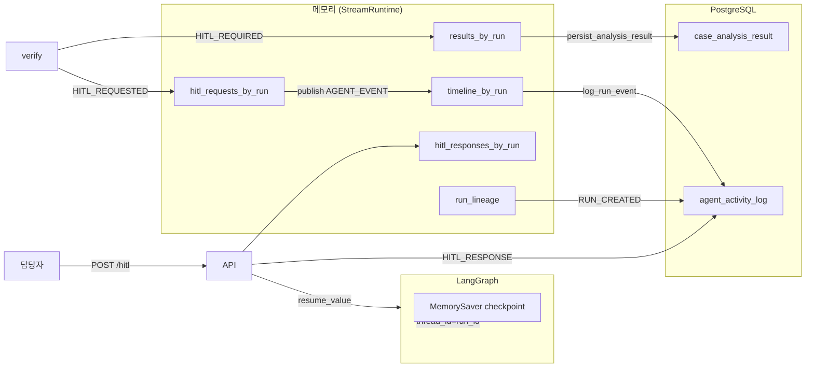
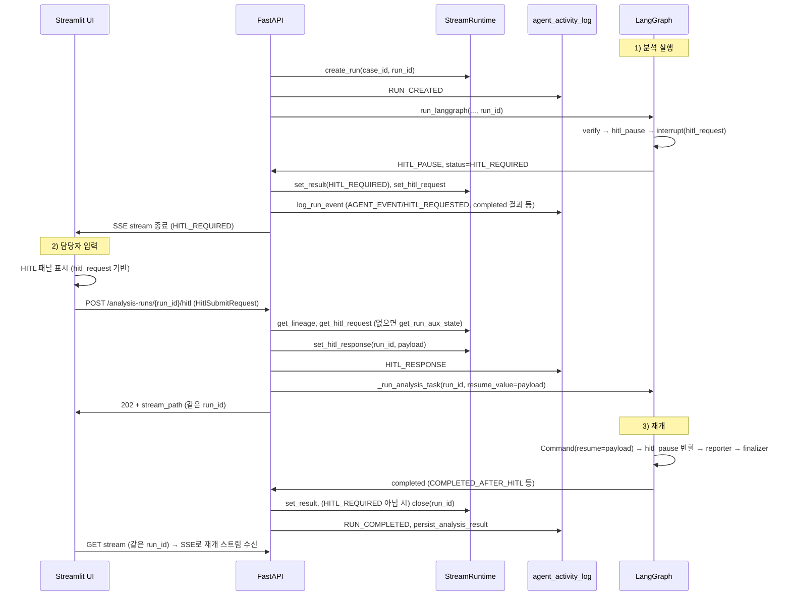

# HITL(Human-in-the-Loop) 동작 및 프로세스

> 시연/설명회용 — HITL 라이프사이클, 데이터 저장·로드, 아키텍처 요약

---

## 목차

1. [HITL이란](#1-hitl이란)
2. [라이프사이클 개요](#2-라이프사이클-개요)
3. [그래프 내 HITL 위치](#3-그래프-내-hitl-위치)
4. [중단 시 저장되는 데이터](#4-중단-시-저장되는-데이터)
5. [재개 시 불러오는 데이터와 이어서 작업](#5-재개-시-불러오는-데이터와-이어서-작업)
6. [데이터 저장소·흐름 요약](#6-데이터-저장소흐름-요약)
7. [API·UI 흐름](#7-apiui-흐름)
8. [설명회 요약 포인트](#8-설명회-요약-포인트)

---

## 1. HITL이란

| 항목 | 설명 |
|------|------|
| **역할** | 에이전트가 “담당자 검토 필요”로 판단한 경우, **자동 진행을 멈추고** 사람 입력을 받은 뒤 **같은 run으로 이어서** 실행 |
| **트리거** | `verify` 노드에서 게이트 적용 결과 `needs_hitl == True` |
| **결과** | 재개 시 `reporter` → `finalizer`로 진행, 최종 상태는 `COMPLETED_AFTER_HITL` 또는 `HOLD_AFTER_HITL` 등 |

---

## 2. 라이프사이클 개요

```
[분석 시작] → screener → intake → planner → execute → critic → verify
                                                                    │
                                    ┌───────────────────────────────┼───────────────────────────────┐
                                    ▼                               ▼                               ▼
                            needs_hitl == False              needs_hitl == True              _enable_hitl == False
                                    │                               │                               │
                                    ▼                               ▼                               ▼
                              reporter                        hitl_pause                         reporter
                              finalizer                       interrupt()                           │
                                    │                         (run 일시정지)                          ▼
                                    ▼                               │                            finalizer
                                   END                        [담당자 입력 대기]                        │
                                                                     │                              ▼
                                                              POST /hitl (응답 제출)                 END
                                                                     │
                                                                     ▼
                                                            Command(resume=hitl_response)
                                                                     │
                                                                     ▼
                                                            hitl_pause 반환값 수신
                                                            → body_evidence["hitlResponse"] 설정
                                                                     │
                                                                     ▼
                                                            reporter → finalizer → END
```

---

## 3. 그래프 내 HITL 위치

- **노드**: `verify` → **(분기)** → `hitl_pause` 또는 `reporter`
- **조건**: `_route_after_verify`  
  - `hitl_request` 있음 + `_enable_hitl != False` → **hitl_pause**  
  - 그 외 → **reporter**
- **hitl_pause 동작**: `interrupt(hitl_request)` 호출 → 스트림에서 **HITL_PAUSE** 이벤트 + `status: HITL_REQUIRED` 반환 후 **같은 run 종료(재개 대기)**  
- **재개 후**: `hitl_pause`가 `Command(resume=...)` 값 수신 → `body_evidence["hitlResponse"]`에 넣어 반환 → **reporter**로 이어짐

---

## 4. 중단 시 저장되는 데이터

### 4.1 메모리 (StreamRuntime)

| 저장소 | 키/용도 | 저장 내용 |
|--------|---------|-----------|
| `_results_by_run[run_id]` | run 최종 결과 | `status: "HITL_REQUIRED"`, `hitl_request` |
| `_hitl_requests_by_run[run_id]` | 현재 run의 HITL 요청 | verify에서 만든 `hitl_request` (reasons, questions 등) |
| `_timeline_by_run[run_id]` | 이벤트 타임라인 | AGENT_EVENT, HITL_REQUESTED, completed(HITL_REQUIRED) 등 |
| `_run_lineage[run_id]` | run 메타 | case_id, parent_run_id, created_at |
| `_queues[run_id]` | SSE 큐 | **HITL_REQUIRED 시 close하지 않음** → 재개 시 같은 run의 스트림 재연결 가능 |

### 4.2 DB 테이블

| 테이블 | 이벤트/컬럼 | 저장 내용 |
|--------|-------------|-----------|
| **dwp_aura.agent_activity_log** | `event_type`, `metadata_json` | RUN_CREATED, AGENT_EVENT(HITL_REQUESTED), completed 시 **HITL_REQUIRED** 반영된 결과, RUN_COMPLETED/RUN_FAILED 등 |
| **dwp_aura.case_analysis_result** | (run 종료 시) | `persist_analysis_result()`로 run 결과 저장 — HITL_REQUIRED인 run도 **한 번 저장** (evidence_map_json 등에 hitl 포함 가능) |

- **재시작 후** HITL 요청/응답 복원은 `get_run_aux_state()`가 **agent_activity_log**에서  
  `RUN_CREATED`, `HITL_REQUESTED`, `HITL_DRAFT`, `HITL_RESPONSE`, `RUN_COMPLETED`, `RUN_FAILED` 행을 시간순으로 읽어  
  `lineage`, `hitl_request`, `hitl_draft`, `hitl_response`, `result_payload`를 구성한다.

---

## 5. 재개 시 불러오는 데이터와 이어서 작업

### 5.1 재개 트리거

- **API**: `POST /api/v1/analysis-runs/{run_id}/hitl` (담당자 응답 payload)
- **동일 run_id**로 재개하며, **새 run을 만들지 않음**.

### 5.2 재개 시 사용하는 데이터

| 단계 | 데이터 소스 | 용도 |
|------|-------------|------|
| run 유효성 | `runtime.get_lineage(run_id)` 또는 `get_run_aux_state(db, run_id)` | run 존재·lineage 확인 |
| HITL 요청 복원 | `runtime.get_hitl_request(run_id)` 또는 `aux["hitl_request"]` | “이 run에 대한 HITL 요청이 있는지” 검증 |
| 케이스 페이로드 | `build_analysis_payload(db, voucher_key)` | body_evidence 등 — 재개 시 **같은 케이스**로 task 재실행 시 사용 |
| HITL 응답 저장 | `runtime.set_hitl_response(run_id, hitl_payload)` | 재개 시 LangGraph에 넘길 `resume_value` |
| DB 기록 | `log_run_event(..., event_type="HITL_RESPONSE", metadata={hitl_response})` | agent_activity_log에 HITL_RESPONSE 한 행 적재 |

### 5.3 이어서 작업되는 방식

1. **API**에서 `_run_analysis_task(run_id=run_id, resume_value=hitl_payload)` 호출 (같은 run_id, 새 run 아님).
2. **LangGraph** `run_langgraph_agentic_analysis(..., run_id=run_id, resume_value=hitl_payload)`:
   - 먼저 **checkpoint 기반 재개**: `graph.astream(Command(resume=hitl_payload), config={"configurable": {"thread_id": run_id}})`
   - `thread_id == run_id`이므로 **MemorySaver**에 저장된 해당 run의 체크포인트에서 재개.
3. **hitl_pause_node**가 재개 시 `interrupt()` 반환값으로 **hitl_response**를 받음 → `body_evidence["hitlResponse"]`에 넣어 반환.
4. 그래프는 **reporter** → **finalizer** → END 로 진행 (screener~verify는 다시 타지 않음).

정리: **agent_activity_log**의 이벤트 시퀀스와 **MemorySaver(thread_id=run_id)** 체크포인트로 “어디서 멈췄는지”가 정해지고, 재개 시 **resume_value**만 추가로 넣어 **hitl_pause 이후 구간**부터 이어서 실행된다.

---

## 6. 데이터 저장소·흐름 요약



| 저장소 | HITL 중단 시 | HITL 재개 시 |
|--------|----------------|----------------|
| **StreamRuntime** | hitl_request, result(HITL_REQUIRED), timeline, lineage 유지; queue close 안 함 | hitl_response set; 같은 run_id로 스트림 재연결 |
| **agent_activity_log** | RUN_CREATED, HITL_REQUESTED, (completed 시점 결과) | HITL_RESPONSE 행 추가; get_run_aux_state로 hitl_request/response 복원 |
| **MemorySaver** | verify 직후 hitl_pause에서 interrupt 직전 상태로 checkpoint | Command(resume=hitl_payload)로 재개 → hitl_pause부터 재실행 |

---

## 7. API·UI 흐름



- **중단 시**: run은 **close되지 않음** → 같은 run_id의 스트림 엔드포인트 유지.
- **재개 시**: UI는 응답의 `stream_path`(같은 run_id)로 **다시 SSE 연결**하여 재개 스트림을 받는다.

---

## 8. 설명회 요약 포인트

- **HITL = “자동 진행 중단 → 담당자 입력 → 같은 run으로 이어서 실행”**  
  새 run이 아니라 **동일 run_id**로 재개된다.
- **트리거**: verify 단계에서 게이트 결과 `needs_hitl == True`일 때만 hitl_pause로 진입.
- **중단 시**:  
  - **메모리**: result(HITL_REQUIRED), hitl_request, timeline, lineage 유지; 큐는 닫지 않음.  
  - **DB**: agent_activity_log에 RUN_CREATED, HITL_REQUESTED, completed 결과 등 저장; 필요 시 case_analysis_result에도 저장.
- **재개 시**:  
  - **lineage / hitl_request**는 runtime 또는 **agent_activity_log**의 `get_run_aux_state()`로 복원.  
  - **hitl_response**는 API가 runtime에 set 후 **LangGraph**에 `Command(resume=hitl_payload)`로 전달.  
  - **체크포인트**(MemorySaver, thread_id=run_id) 덕분에 **hitl_pause 이후**부터 재실행되고, reporter → finalizer로 진행.
- **테이블**: HITL 요청/응답의 “원천”은 **agent_activity_log**의 이벤트 시퀀스; 재시작 후에도 여기서 복원해 동일 run으로 재개할 수 있다.
