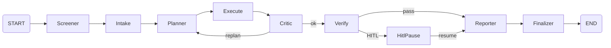

# LangGraph 오케스트레이션 구조 (현행)

> LangGraph·LangChain·LangFuse 기반 에이전트 흐름, 노드 역할, 도구 실행, 자율성 검증.  
> 코드 기준: `agent/langgraph_agent.py`, `agent/agent_tools.py` (구 `skills.py` 명칭 변경됨).

---

## 목차

1. [기술 스택과 역할](#1-기술-스택과-역할)
2. [메인 오케스트레이션 흐름](#2-메인-오케스트레이션-흐름)
3. [노드별 역할 요약](#3-노드별-역할-요약)
4. [실행 노드(execute)와 도구(Tool)](#4-실행-노드execute와-도구tool)
5. [플래너와 도구 선택 방식](#5-플래너와-도구-선택-방식)
6. [상태(AgentState)와 데이터 흐름](#6-상태agentstate와-데이터-흐름)
7. [HITL·재개와의 연계](#7-hitl재개와의-연계)
8. [그래프 시각화 현황](#8-그래프-시각화-현황)
9. [자율형 에이전트 검증 및 고도화 포인트](#9-자율형-에이전트-검증-및-고도화-포인트)

---

## 1. 기술 스택과 역할

| 기술 | 역할 | 코드/설정 |
|------|------|-----------|
| **LangGraph** | 오케스트레이션: 상태 그래프, 노드·엣지, 조건 분기, `interrupt()`/`Command(resume)` | `agent/langgraph_agent.py` — `build_agent_graph()`, `run_langgraph_agentic_analysis()` |
| **LangChain** | 도구(Tool) 계약: `StructuredTool`, 입력/출력 스키마 | `agent/agent_tools.py` — `get_langchain_tools()`, `agent/tool_schemas.py` — `ToolContextInput` |
| **LangFuse** | 관측성(트레이스·세션): run_id별 콜백 | `utils/config.py` — `get_langfuse_handler(session_id=run_id)` |

- **“Skill” 용어**: 프로젝트에서는 **Skill 프레임워크를 사용하지 않음**. 모든 실행 capability는 **LangChain Tool**로 등록되어 있으며, 레지스트리/모듈명은 `agent_tools.py`·`TOOL_REGISTRY`로 정리됨.

---

## 2. 메인 오케스트레이션 흐름

실제 `build_agent_graph()`가 등록하는 노드와 엣지입니다.

```
START
  │
  ▼
screener         Phase 0 — 전표 원시 데이터에서 케이스 유형 결정론적 분류
  │              (HOLIDAY_USAGE / LIMIT_EXCEED / PRIVATE_USE_RISK / UNUSUAL_PATTERN / NORMAL_BASELINE)
  │              body_evidence.case_type, intended_risk_type 전파
  ▼
intake           전표 입력 파싱 + 위험 지표 정규화 (flags 파생)
  │              NODE_START / NODE_END, (선택) THINKING_TOKEN / THINKING_DONE
  ▼
planner          flags 기반 조사 계획 수립 (도구 호출 순서·이유 결정)
  │              PLAN_READY, NODE_END
  ▼
execute          계획된 도구를 순서대로 호출 (LangChain Tool invoke)
  │              TOOL_CALL / TOOL_RESULT / TOOL_SKIPPED / SCORE_BREAKDOWN
  ▼
critic           tool_results 기반 과잉 주장·반례 검토, recommend_hold 판정
  │              NODE_START / NODE_END
  ├─ replan 필요 & 루프 미초과 ──▶ planner (재진입)
  └─ 그 외 ──────────────────────▶ verify
  ▼
verify           자동 확정 가능 여부 게이트
  │              GATE_APPLIED, HITL_REQUESTED (필요 시), build_hitl_request()
  ├─ HITL 필요 ──▶ hitl_pause   interrupt() 후 같은 run으로 resume
  └─ 자동 확정 ──▶ reporter
  ▼
reporter         최종 설명·요약 생성 (hitlResponse 반영 시 COMPLETED_AFTER_HITL 등)
  ▼
finalizer        final_result 생성 → completed 이벤트 yield
  ▼
END
```

### Mermaid (상위 흐름)



---

## 3. 노드별 역할 요약

| 노드 | 단계 | 주요 출력 | 이벤트 | 비고 |
|------|------|------------|--------|------|
| `screener` | Phase 0 | `screening_result`, `intended_risk_type` | NODE_START, SCREENING_RESULT, NODE_END | `run_screening(body)` |
| `intake` | analyze | `flags` | NODE_START, (THINKING_*), NODE_END | `_derive_flags(body_evidence)` |
| `planner` | plan | `plan` (도구 호출 목록) | NODE_START, PLAN_READY, NODE_END | `_plan_from_flags(flags)` |
| `execute` | execute | `tool_results`, `score_breakdown` | TOOL_CALL, TOOL_RESULT, TOOL_SKIPPED, SCORE_BREAKDOWN | LangChain Tool 순차 호출 |
| `critic` | critique | `critique` (recommend_hold 등) | NODE_START, NODE_END | critic 루프 최대 2회 |
| `verify` | verify | `verification`, `hitl_request` | GATE_APPLIED, HITL_REQUESTED | HITL 필요 시 hitl_pause로 분기 |
| `hitl_pause` | HITL | resume 시 `body_evidence.hitlResponse` 반영 | interrupt() 후 Command(resume)로 재개 | 동일 run_id 유지 |
| `reporter` | report | `final_result` (설명 포함) | NODE_START, THINKING_*, NODE_END | hitl_response 반영 시 verdict 분기 |
| `finalizer` | finalize | `final_result` (완성) | completed yield | run 종료 |

---

## 4. 실행 노드(execute)와 도구(Tool)

`execute_node`는 **planner가 수립한 plan**을 순회하며 `get_langchain_tools()`로 얻은 **LangChain StructuredTool**을 이름으로 조회해 순차 호출합니다.  
도구 등록소는 `agent/agent_tools.py`의 **TOOL_REGISTRY** (구 SKILL_REGISTRY)이며, 각 항목은 `ToolContextInput` 스키마로 감싸져 LangChain tool로 노출됩니다.

```
execute
  │
  ├──▶ holiday_compliance_probe    휴일/휴무/연차 사용 정황 검증 (hr_status, occurredAt, budat, cputm)
  ├──▶ budget_risk_probe           예산 초과·금액 지표 검증 (amount vs threshold)
  ├──▶ merchant_risk_probe         거래처·가맹점 MCC 기반 업종 위험도 (고위험 업종 분류)
  ├──▶ document_evidence_probe     전표 라인아이템·문서 증거 수집 (document.items)
  ├──▶ policy_rulebook_probe       내부 규정집 RAG 조회 (policy_refs, ref_count)
  └──▶ legacy_aura_deep_audit     [조건부] 기존 Aura 심층 분석
                                  생략 조건: policy_ref_count ≥ 2 AND lineItemCount > 0
                                            AND missingFields 없음 AND budgetExceeded 아님
  ▼
score_breakdown  policy_score + evidence_score → final_score, severity
```

### 도구별 요약

| 도구 | 역할 | 생략 가능 |
|------|------|------------|
| holiday_compliance_probe | 휴일/휴무/연차 사용 정황 검증 | 아니오 |
| budget_risk_probe | 예산 초과·금액 지표 검증 | 아니오 |
| merchant_risk_probe | MCC 기반 업종 위험도 | 아니오 |
| document_evidence_probe | 전표 라인·문서 증거 수집 | 아니오 |
| policy_rulebook_probe | 규정집 RAG 조회 | 아니오 |
| legacy_aura_deep_audit | 기존 Aura 심층 분석 | **조건부** (`_should_skip_tool`) |

---

## 5. 플래너와 도구 선택 방식

- **계획 생성**: `_plan_from_flags(flags)` — **플래그(isHoliday, budgetExceeded, mccCode 등)에 따라** 도구 목록과 순서가 **규칙 기반**으로 결정됨.
- **데이터 드리븐**: 플래그가 있으면 해당 probe를 plan에 포함, `document_evidence_probe`·`policy_rulebook_probe`는 항상 포함, legacy는 설정 시 마지막에 추가.
- **재계획**: critic에서 replan_required일 때 `replan_context`로 이전에 실행된 도구 집합을 넘기고, `_plan_from_flags` 결과에서 이미 실행된 도구는 제외(단, policy/document는 항상 재실행 가능)해 plan을 조정.

즉, **도구 선택은 “플래그 기반 규칙 + planner 출력”**이며, 스텝마다 LLM이 도구를 골라 호출하는 ReAct 스타일은 아님.

---

## 6. 상태(AgentState)와 데이터 흐름

| 상태 필드 | 채우는 노드 | 사용처 |
|------------|-------------|--------|
| case_id, body_evidence, intended_risk_type | 입력 | 전 노드 |
| screening_result | screener | intake 이후 |
| flags | intake | planner, execute, critic, verify |
| plan | planner | execute |
| tool_results | execute | critic, verify, reporter, score |
| score_breakdown | execute | verify, reporter |
| critique, critic_output | critic | _route_after_critic |
| verification, hitl_request | verify | _route_after_verify, hitl_pause |
| body_evidence.hitlResponse | hitl_pause (resume 시) | reporter |
| final_result | reporter → finalizer | 스트림 completed |

- **체크포인터**: LangGraph `MemorySaver`, `configurable.thread_id = run_id`. HITL 재개 시 동일 run_id로 `Command(resume=hitl_payload)` 전달해 hitl_pause 이후부터 재실행.

---

## 7. HITL·재개와의 연계

- **분기**: `_route_after_verify` → `hitl_request` 존재 시 `hitl_pause`, 없으면 `reporter`.
- **중단**: `hitl_pause_node`에서 `interrupt(hitl_request)` 호출 → 스트림에 HITL_PAUSE·status HITL_REQUIRED 전달 → **같은 run_id**로 재개 대기.
- **재개**: API `POST /analysis-runs/{run_id}/hitl`에서 `resume_value` 설정 후 `run_langgraph_agentic_analysis(..., run_id=run_id, resume_value=hitl_payload)` 호출 → `Command(resume=...)`로 그래프 재개 → hitl_pause가 반환값을 `body_evidence["hitlResponse"]`에 반영 → reporter → finalizer.

자세한 데이터 저장·로드·테이블은 `docs/Edu/HITL Logic.md` 참고.

---

## 8. 그래프 시각화 현황

| 항목 | 방식 | 파일 |
|------|------|------|
| 메인 오케스트레이션 | 노드·엣지 하드코딩 후 matplotlib PNG | `ui/shared.py` — `draw_agent_graph()` |
| execute 내부 도구 흐름 | 노드·엣지 하드코딩 후 matplotlib PNG | `ui/shared.py` — `draw_tool_execution_graph()` (구 draw_skill_execution_graph) |
| 표시 | `st.image()` | `ui/studio.py` |

- **참고**: 실제 그래프에는 **screener**가 START 직후에 있으나, 현재 `draw_agent_graph()`는 start → intake부터 그리도록 되어 있을 수 있음. 노드 목록/엣지는 `langgraph_agent.build_agent_graph()` 정의와 맞추는 것이 좋음.

---

## 9. 자율형 에이전트 검증 및 고도화 포인트

### 현재 구현이 충족하는 점

- **오케스트레이션**: LangGraph로 analyze → plan → execute → critique → verify → (HITL) → report → finalize 흐름이 명시적.
- **도구 계약**: 실행 capability가 LangChain Tool로 통일되어 입력/출력 스키마가 있음.
- **증거 기반**: execute의 tool_results가 critic·verify·reporter로 전달되어, 주장이 도구 결과에 기반함.
- **HITL**: 필요 시 interrupt로 중단, 같은 run으로 resume하여 reporter까지 이어짐.
- **관측성**: LangFuse로 run_id 단위 트레이스 연동 가능.

### 고도화 시 고려할 점

1. **도구 선택의 자율성**  
   현재 plan은 **플래그 기반 규칙**(`_plan_from_flags`)으로 고정됨. 아래 **자율화 권장 방안** 참고.

---

#### 자율화 권장 방안 (최우선 제안)

| 방안 | 설명 | 장점 | 단점 |
|------|------|------|------|
| **A. Planner LLM 구조화 출력** | planner 노드에서 **한 번** LLM 호출. 입력: `flags`, `case_type`, 전체 도구 목록(name·description). 출력: **고정 스키마**의 계획(`[{ tool, reason }]`). 도구 이름은 `TOOL_REGISTRY` 키로 제한해 검증 후만 실행. | 계획이 한 번에 확정되어 **감사·설명 가능**. 실행부(execute) 변경 없이 evidence 기반 유지. PLAN_READY로 동일 이벤트 유지. | LLM 1회 비용·지연. 스키마 이탈 시 fallback(`_plan_from_flags`) 필요. |
| B. ReAct 스타일 루프 | execute 직후 매번 “다음 도구 또는 critic 진입”을 LLM이 선택. | 단계별 최대 유연성. | 호출 횟수·비용 증가, “전체 계획”이 사후에만 파악되어 감사 추적이 복잡. |
| C. 정책 테이블/설정 | `(case_type, flags)` → 도구 순서를 YAML/DB로 매핑. planner는 이 매핑만 조회. | 구현 단순, 해석 용이. | 규칙 확장일 뿐, “학습” 자율성은 아님. |

**권장: A (Planner LLM 구조화 출력)**  
- **이유**: 엔터프라이즈 감사에서 “어떤 계획으로 실행했는지”가 선행해서 드러나야 하며, 도구 선택은 **데이터(flags·case_type)·도구 설명**에 기반한 LLM 판단으로 자율화하면서, 도구 이름 검증과 fallback으로 안정성을 확보할 수 있음.  
- **구현 포인트**: (1) planner에서 `flags`·`case_type`·`TOOL_REGISTRY`(name, description)를 LLM에 전달. (2) 응답을 `PlanStep` 리스트로 파싱(JSON schema 또는 Pydantic). (3) `step.tool_name in TOOL_REGISTRY`인 항목만 채택, 그 외 또는 파싱 실패 시 `_plan_from_flags(flags)` 사용. (4) 기존 `execute_node`는 `state["plan"]`을 그대로 소비하므로 변경 없음.

2. **Critic 루프 상한**  
   `_MAX_CRITIC_LOOP = 2`로 제한되어 있어, 복잡한 케이스에서 재계획 횟수가 부족할 수 있음. 설정화 또는 동적 상한 검토.

3. **그래프 시각화와 코드 일치**  
   `draw_agent_graph()`에 screener 노드가 반영되어 있는지 확인하고, `build_agent_graph()`와 동기화하면 설명회 시 혼동을 줄일 수 있음.

4. **Skill → Tool 용어 정리**  
   코드·문서에서 “skill” 대신 “tool”과 `agent_tools`·`TOOL_REGISTRY`를 사용하도록 정리 완료 시, 설명 시 일관성이 높아짐.
